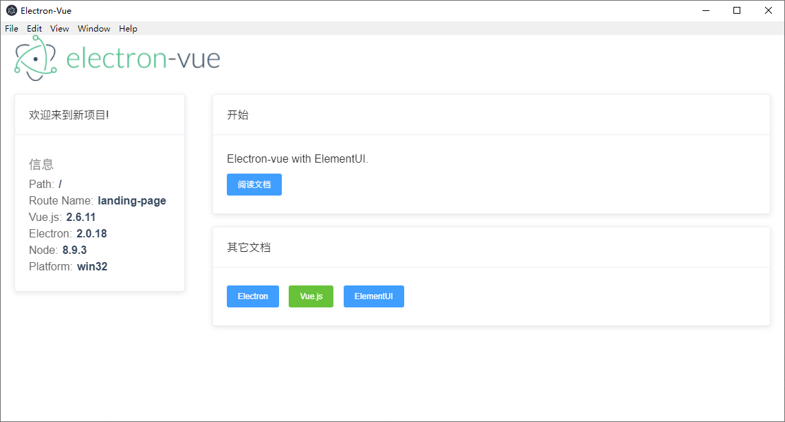

# electron-vue-elementui-demo
electron-vue-elementui-demo

> An electron-vue project with ElementUI.

## Screenshot



## Build Setup

``` bash
# clone
git clone https://github.com/yanghan1999/electron-vue-elementui-demo my-project
# cd
cd my-project
# install dependencies
npm install
# serve with hot reload at localhost:9080
npm run dev
# build electron application for production
npm run build

```

---
